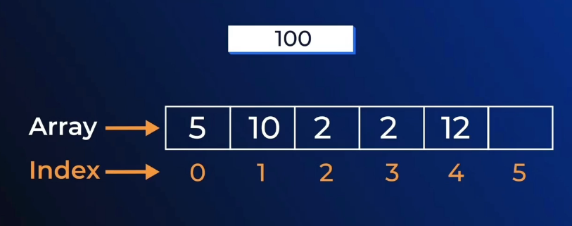
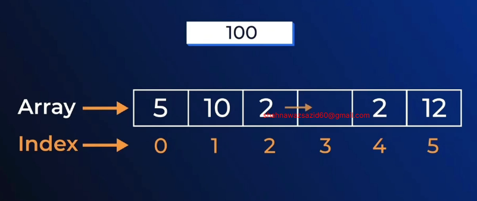
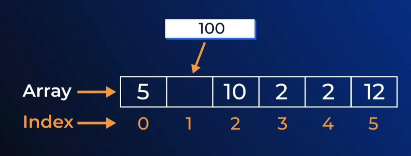
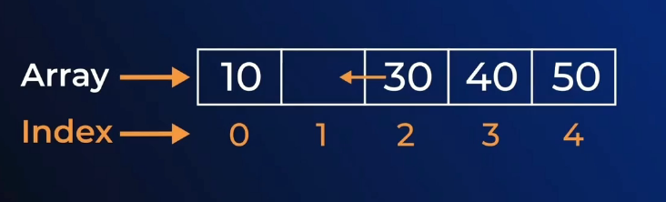

# M-9-ARRAY-OPERATIONS-IN-C

- Insert new element in an array
- increase the array index



- move the indexes





```c
#include <stdio.h>

int main()
{
    int n;
    scanf("%d", &n);
    int arr[n + 1];

    for (int i = 0; i < n; i++)
    {
        scanf("%d", &arr[i]);
    }
    int idx, val;

    scanf("%d %d", &idx, &val);

    for (int i = n; i >= idx + 1; i--)
    {
        arr[i] = arr[i - 1];
    }

    arr[idx] = val;

    for (int i = 0; i <= n; i++)
    {
        printf("%d ", arr[i]);
    }

    return 0;
}
```

- delete element from array 




- in static array we can not delete because once its declared we can not increase or decrease length. we have to handle this by ignoring the targeted field. we can not decrease the length while initializing because of the value of last index will be eliminated. 


```c
#include <stdio.h>

int main()
{
    int n;
    scanf("%d", &n);
    int a[n];

    for (int i = 0; i < n; i++)
    {
        scanf("%d", &a[i]);
    }
    int idx;
    scanf("%d", &idx);

    for (int i = idx; i < n - 1; i++)
    {
        a[i] = a[i + 1];
    }
    n--;
    for (int i = 0; i < n; i++)
    {
        printf("%d ", a[i]);
    }

    return 0;
}
```
- value swapping of two values 

```c
#include <stdio.h>

int main()
{
    int a = 20;
    int b = 10;
    int temp = a;
    a = b;
    b = a;

    printf("%d\n%d", a,b); // 10 10
    return 0;
}
```

- this is not possible because we will lose the value of a . we have to keep in temporary variable ;


```c
// #include <stdio.h>

// int main()
// {
//     int a = 20;
//     int b = 10;
//     a = b;
//     b = a;

//     printf("%d\n%d", a,b);
//     return 0;
// }


#include <stdio.h>

int main()
{
    int a = 20;
    int b = 10;
    int temp = a;
    a = b;
    b = temp;

    printf("%d\n%d", a,b);
    return 0;
}
```

- for array reverse we use `two pointer technique` . To reverse an array, use the two-pointer technique by initializing one pointer at the beginning and another at the end. Swap the elements at these positions and move the pointers toward each other. Continue this process while the starting pointer is less than the ending pointer. This works for both odd and even length arrays without any special handling.

```c

#include <stdio.h>

int main()
{
    int n;
    scanf("%d", &n);   // take input first

    int a[n];          // now n is valid

    for (int i = 0; i < n; i++)
    {
        scanf("%d", &a[i]);
    }

    int i = 0;
    int j = n - 1;

    while (i < j)
    {
        int temp = a[i];
        a[i] = a[j];
        a[j] = temp;

        i++;
        j--;
    }

    for (int i = 0; i < n; i++)
    {
        printf("%d ", a[i]);
    }

    return 0;
}
```

- reversing using for loop 

```c
#include <stdio.h>

int main()
{
    int n;
    scanf("%d", &n);

    int a[n];

    for (int i = 0; i < n; i++)
    {
        scanf("%d", &a[i]);
    }

    for (int i = 0, j = n - 1; i < j; i++, j--)
    {
        int temp = a[i];
        a[i] = a[j];
        a[j] = temp;
    }

    for (int i = 0; i < n; i++)
    {
        printf("%d ", a[i]);
    }

    return 0;
}
```
- copy two elements from two array 

```c
#include <stdio.h>

int main()
{
    int n;
    scanf("%d", &n);
    int arr[n];
    for(int i = 0; i < n; i++)
    {
        scanf("%d", &arr[i]);
    }

    int m;
    scanf("%d", &m);
    int b[m];
    for(int i = 0; i < m; i++)
    {
        scanf("%d", &b[i]);
    }

    int copy_size = n+m;

    int copy[copy_size];
    for(int i = 0; i < n; i++)
    {
        copy[i] = arr[i];
    }
    for(int i = 0; i < m; i++)
    {
        copy[n+i] = b[i];
    }
    for(int i = 0; i < copy_size; i++)
    {
        printf("%d ", copy[i]);
    }
    return 0;
}
```